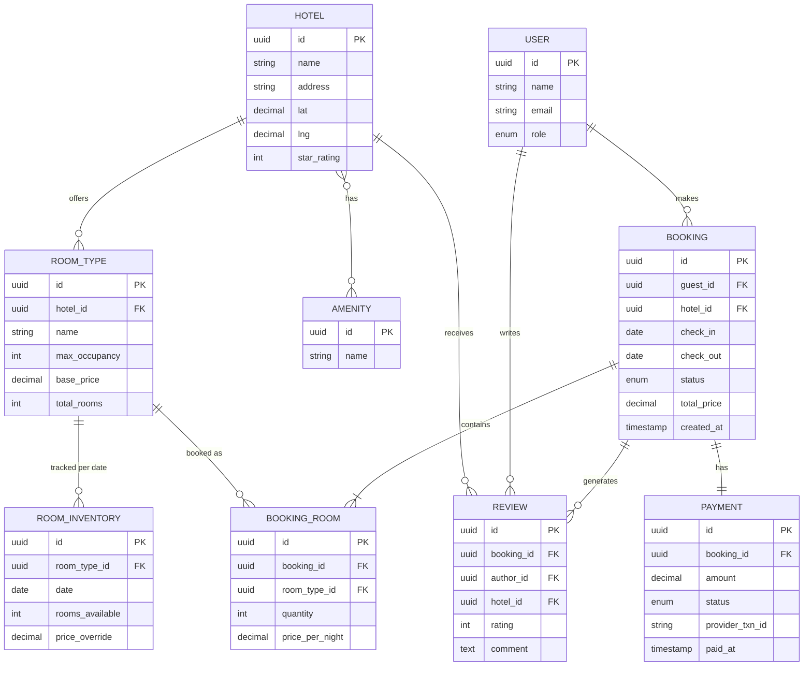
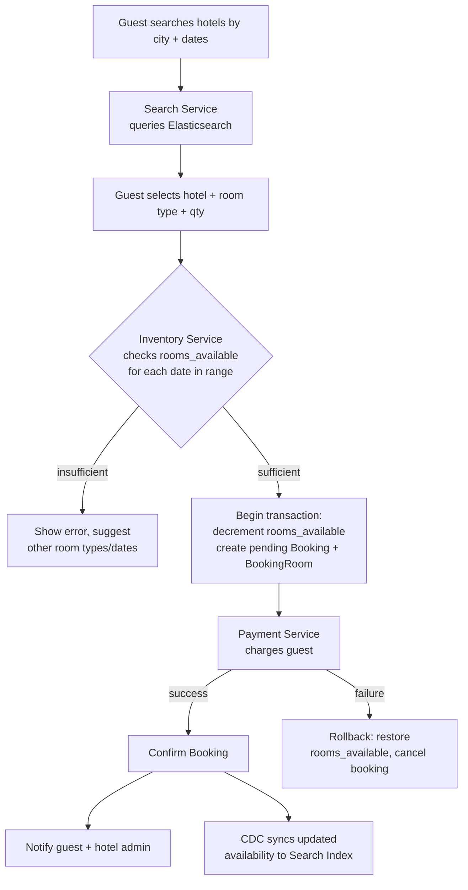

# Day 24 — Designing a Hotel Booking Database

> Module: Backend Development — System Design / Database Design Practice
> Topic: Design the database schema and booking flow for a hotel reservation system (e.g. Booking.com / OYO style)

---

## 1. Requirements

**Functional**
- Hotels have multiple **room types** (Deluxe, Suite, etc.), each with its own inventory count and price
- Guests search hotels by city/location, dates, guest count, price range
- Guests book one or more rooms of a room type for a date range (no overbooking)
- Payments processed per booking (supports partial refunds on cancellation)
- Guests can cancel/modify bookings per hotel cancellation policy
- Reviews/ratings per hotel
- Hotel admin manages room inventory, pricing, availability

**Non-functional**
- Read-heavy (search/browse >> writes), but booking writes need strong consistency
- No overbooking — must never sell more rooms of a type than physically exist for a given night
- Scale: thousands of hotels, high search QPS around peak travel seasons
- Pricing changes dynamically by date (weekday/weekend/season/demand)

**Key difference vs. Airbnb model**
- Airbnb: 1 property = 1 unit, availability is boolean per date.
- Hotel: 1 hotel has many **room types**, each room type has a **count of rooms** (inventory), so availability is a *quantity* per date, not a boolean — this changes the schema and the overbooking-prevention logic.

---

## 2. Core Entities

- **Hotel**
- **RoomType** (belongs to a hotel — e.g. "Deluxe King")
- **RoomInventory** (count of rooms of a type available per date)
- **Booking**
- **BookingRoom** (line item: which room type, how many rooms, for which booking)
- **Payment**
- **Guest (User)**
- **Review**
- **Amenity**

---

## 3. ER Diagram

---

## 4. Key Design Decisions

**Preventing overbooking (the core hard problem)**
- `ROOM_INVENTORY(room_type_id, date)` holds `rooms_available` as a **decrementing counter**, not a boolean.
- On booking: run a transaction that checks `rooms_available >= requested_qty` for every date in the stay, then decrements it — guarded by `SELECT ... FOR UPDATE` (row lock) or an atomic `UPDATE ... WHERE rooms_available >= qty` (optimistic, single statement — safer under high concurrency, avoids long lock hold times).
- On cancellation: increment `rooms_available` back for the cancelled date range.
- At high scale, funnel booking attempts for the same `(room_type_id, date)` through a queue or per-key lock (Redis) to avoid contention/deadlocks during flash-sale-like demand spikes.

**Why `BOOKING_ROOM` as a separate table**
- One booking can include multiple room types/quantities (e.g. 2 Deluxe + 1 Suite for a group), and each line item can have its own negotiated/date-based price — a single `BOOKING` row can't capture that.

**Pricing**
- `ROOM_INVENTORY.price_override` allows per-date dynamic pricing (weekday/weekend/season/demand-based) without touching `ROOM_TYPE.base_price`, which is the fallback/default.

**Search performance**
- Same pattern as Airbnb: keep Postgres/MySQL as source of truth, sync hotel/room-type/availability summaries into Elasticsearch via CDC for fast filtered search (location, dates, price, amenities).
- Precompute a lightweight "min available rooms across the stay range" per hotel in the search index so search doesn't hit the transactional DB for every query.

**Cancellations & refunds**
- `Booking.status` (pending → confirmed → cancelled/completed) plus a cancellation policy reference on `Hotel` or `RoomType` determines refund %; `Payment` can have a linked `refund_amount` and `refund_status`.

**Scaling**
- Partition `ROOM_INVENTORY` and `BOOKING` by date range or hotel region as data grows — inventory rows grow as `room_types × dates`, so this table is the biggest write/read hotspot.
- Cache hotel detail + current availability summary (Redis), invalidate on booking/cancellation.

---

## 5. Booking Flow Diagram

---

## 6. Interview Talking Points
- Why quantity-based inventory instead of individual room-unit tracking? → simpler at scale; most OTAs don't assign a physical room until check-in, they just sell against a count per room type.
- How do you prevent two guests from booking the last room simultaneously? → atomic conditional `UPDATE` on `rooms_available`, or row-level locking inside a transaction; discuss optimistic vs pessimistic locking tradeoffs.
- How would you extend this for a multi-night stay spanning inventory changes mid-stay (e.g. a rate change on day 3)? → each date row in `ROOM_INVENTORY` has its own price, `BOOKING_ROOM` can reference the stay range and pricing is summed per-night at booking time.
- Airbnb vs Hotel schema difference: boolean availability per unit vs. count-based inventory per room type — walk through why that changes the whole booking transaction logic.