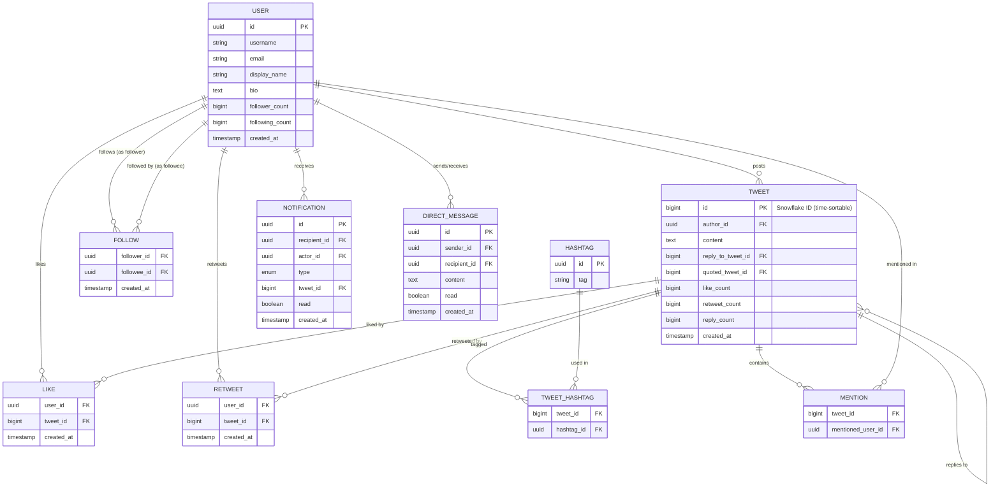
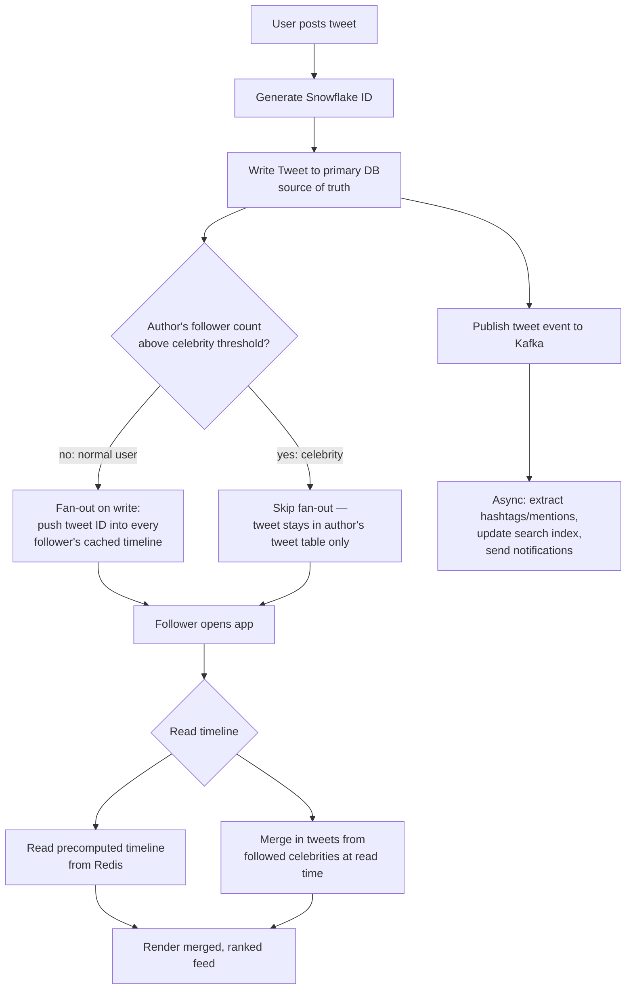

# Day 24 — Designing a Twitter-style Database

> Module: Backend Development — System Design / Database Design Practice
> Topic: Design the database schema, feed-generation strategy, and flow for a Twitter/X-like platform

---

## 1. Requirements

**Functional**
- Users create accounts, follow/unfollow other users
- Users post tweets (text, media, optional reply-to, optional quote-tweet)
- Users like, retweet, and reply to tweets
- Users see a home timeline/feed of tweets from people they follow, roughly reverse-chronological
- Hashtags and @mentions are extracted and searchable
- Notifications for likes, retweets, replies, mentions, new followers
- Direct messages between users

**Non-functional**
- Extreme read/write asymmetry: reads (viewing feeds) vastly outnumber writes (posting tweets)
- Feed generation must be fast (<200ms) even though a user follows hundreds/thousands of accounts
- Celebrity problem: some accounts (e.g. 100M+ followers) post a tweet that must reach massive fan-out
- High write throughput on likes/retweets (viral tweet can get millions of likes in minutes)
- Eventual consistency acceptable for counts (like count, retweet count) and feed ordering
- Strong consistency wanted for core writes: the tweet itself must never be lost

---

## 2. Core Entities

- **User**
- **Tweet** (can reference a parent for reply, or a quoted tweet)
- **Follow** (edge: follower → followee)
- **Like**
- **Retweet**
- **Hashtag** / **TweetHashtag** (junction)
- **Mention** (junction: tweet → mentioned user)
- **Timeline / Feed cache** (materialized, not a normalized table — see below)
- **Notification**
- **DirectMessage**

---

## 3. ER Diagram

---

## 4. Key Design Decisions

**Tweet IDs — Snowflake, not auto-increment**
- Tweets need globally unique, roughly time-sortable IDs generated across many distributed nodes without coordination.
- A Snowflake-style ID (timestamp bits + machine/shard ID + sequence number) lets you sort by recency directly from the ID and shard by ID range, without a single auto-increment bottleneck.

**Feed generation — the core hard problem**
Two competing strategies:

| Strategy | How it works | Good for | Bad for |
|---|---|---|---|
| **Fan-out on write (push)** | When a user tweets, immediately insert the tweet ID into a precomputed timeline (Redis list/sorted set) for every follower | Normal users (few thousand followers) — feed reads are O(1), just read the cached list | Celebrities with 50M+ followers — one tweet triggers 50M writes ("thundering herd") |
| **Fan-out on read (pull)** | Feed is computed at read time by merging recent tweets from everyone a user follows | Celebrities — no explosive write fan-out | Normal users — every feed load does a scatter-gather across hundreds of "following" — slower reads |

- **Real-world answer: hybrid.** Push-based fan-out for normal accounts; for accounts above a follower threshold (e.g. 1M+), skip fan-out and merge their tweets into the timeline lazily at read time. Twitter's actual architecture does exactly this.
- The materialized per-user timeline is **not** the source of truth — it's a cache (Redis sorted set keyed by user_id, scored by tweet_id/timestamp). The `TWEET` table in the primary DB remains the source of truth; the timeline cache can be rebuilt from `FOLLOW` + `TWEET` if lost.

**Counters (like_count, retweet_count, reply_count)**
- Denormalized onto `TWEET` for fast reads (don't `COUNT(*)` a LIKE table with millions of rows on every tweet render).
- Updated via async counter increment (message queue / Kafka event → counter service), not a synchronous transaction on every like — a viral tweet getting 10K likes/sec would deadlock a naive `UPDATE tweets SET like_count = like_count + 1` under high contention. Use an eventually-consistent counter (Redis `INCR`, periodically flushed to the DB) instead.

**Follow graph at scale**
- `FOLLOW` is a simple edge table, but at scale (a user following 5,000 accounts, a celebrity with 100M followers) it's stored/queried through a graph-optimized store or heavily indexed/sharded relational table — indexed on both `(follower_id)` and `(followee_id)` since you need "who do I follow" and "who follows this account" both.

**Search / Hashtags**
- Like Airbnb/Hotel search: sync tweets into Elasticsearch via CDC for full-text and hashtag search; primary DB stays normalized.

**Scaling**
- Shard `TWEET` and `LIKE`/`RETWEET` by `author_id` or by the Snowflake ID's embedded shard bits.
- Cache hot tweets (viral) and hot user timelines in Redis; primary DB absorbs the write-behind traffic, not the read traffic.

---

## 5. Flow Diagram — Posting a Tweet & Feed Delivery

---

## 6. Interview Talking Points
- Push vs pull fan-out tradeoff, and why a hybrid model is necessary once you have celebrity-scale accounts.
- Why tweet IDs are Snowflake-style rather than DB auto-increment — need for time-sortable, globally unique IDs generated without central coordination across shards.
- Why like/retweet counts are eventually-consistent denormalized counters instead of live `COUNT(*)` queries.
- How would you handle a tweet going viral (millions of likes/retweets in minutes)? → async counters, caching hot tweets, rate-limiting write amplification.
- Where would you introduce a queue (Kafka/SQS)? → decoupling tweet-write from notification/search-index/analytics fan-out so the write path to the primary DB stays fast.
